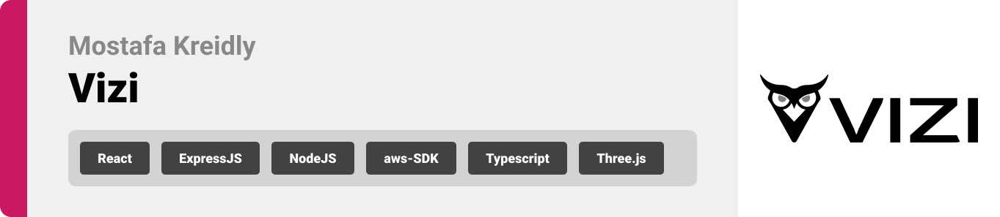
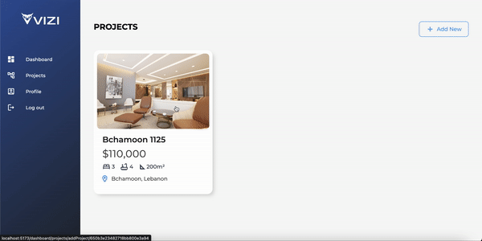
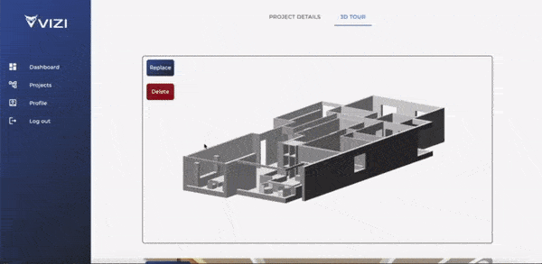
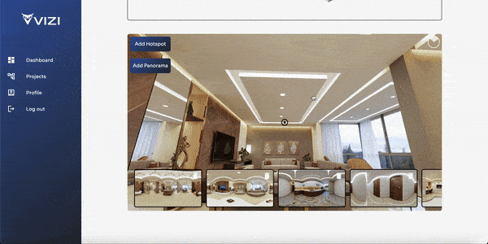
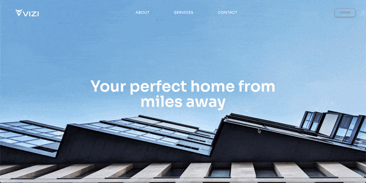

<br><br>


- [Project Description](#project)
- [User Types](#user-types)
- [Features of the App](#features)
- [Tech Stack](#tech)
  - [Frontend](#front)
  - [Backend](#back)
- [Prototyping](#proto)
- [Demo](#demo)
- [Performance](#perf)
- [How to Run](#run)
  - [Prerequisites](#pre)
  - [Installation](#inst)

</br>
</br>
<!-- project philosophy -->

<a id="project"></a>

> A platform that allows construction companies to showcase their projects through 3D objects, and virtual tours of the space using panoramic images. The platform enhances the visibility of the company’s work and creates an immersive experience for users.

## User Types

- Company
- Customer (general)

<a id="features"></a>

## Features

### Company:

- As a construction company, I want to create a profile for my company, so I can gain exposure for my projects.
- As a construction company, I want to edit my profile, so I can keep my information up to date.
- As a construction company, I want to create a virtual tour of my project, to attract potential customers.

### Customer:

- As a customer, I want to browse for multiple projects, so I can see different options.
- As a customer, I want to roam around in the space, so I can see different angles.

<br><br>

<a id="tech"></a>

<!-- Tech stack -->


## Vizi is built using the following technologies:

<a id="back"></a>

## Backend

- [Node.js](https://nodejs.org/) (v18.1.0) with Express framework: Powers the server-side logic and API endpoints, facilitating data retrieval and storage. Developed in TypeScript (TS) for enhanced type safety.

- [MongoDB](https://www.mongodb.com/) (v4.4): Serves as the primary database, storing project-related data efficiently.

- [Zod](https://github.com/colinhacks/zod): Implements data validation in TypeScript (TS) for incoming requests, ensuring data integrity and type safety.

## Media Storage

- AWS S3 bucket (via [aws-sdk](https://aws.amazon.com/sdk-for-javascript/)): Utilized for media asset storage, including images and videos, ensuring scalability and high availability.

<a id="front"></a>

## Frontend

- [React](https://reactjs.org/) (v17): Empowers the user interface, providing a responsive and dynamic user experience. Developed in TypeScript (TS) for a robust type system.

- [react-three-fiber](https://github.com/pmndrs/react-three-fiber) (v5): Enhances the project's 3D capabilities by simplifying Three.js integration within a React environment. Utilizes TypeScript (TS) for type safety.

- [egjs-view360](https://github.com/naver/egjs-view360): Seamlessly integrates 360° panoramic images, delivering an immersive visual experience for users.

- [Zod](https://github.com/colinhacks/zod): Implements client-side data validation in TypeScript (TS) to ensure data consistency and improve the frontend's reliability.

- [Tailwind CSS](https://tailwindcss.com/): Streamlines styling and provides a utility-first approach to building user interfaces, making it easier to create beautiful designs.

- [Framer Motion](https://www.framer.com/motion/) : Adds smooth animations and transitions to the user interface, enhancing the overall user experience.

- [Material-UI](https://mui.com/) : Provides a set of pre-built UI components and styles for designing a modern and responsive frontend.

- [Vite](https://vitejs.dev/): A fast, opinionated build tool that significantly speeds up frontend development. It offers blazingly fast development server and building capabilities.

<br><br>

<a id="proto"></a>

<!-- Prototyping -->


> We designed Vizi using wireframes and mockups, iterating on the design until we reached the ideal layout for easy navigation and a seamless user experience.

## Wireframes

| Get Started                              | Dashboard                                    | Create Project                            |
| ---------------------------------------- | -------------------------------------------- | ----------------------------------------- |
|  |  |  |

## Mockups

| Get Started                                     | Dashboard Projects                          | Customer Screen                             |
| ----------------------------------------------- | ------------------------------------------- | ------------------------------------------- |
|  |  |  |

<br><br>

<a id="demo"></a>

<!-- Implementation -->


> Using the wireframes and mockups as a guide, we implemented the Vizi app with the following features:

### Company Screens (Web)

| Landing screen                                | Sign-up screen                             |
| --------------------------------------------- | ------------------------------------------ |
|  |  |

| Login screen                              | Company Home                                    |
| ----------------------------------------- | ----------------------------------------------- |
|  |  |

| Get Started                            | Company Dashboard                       |
| -------------------------------------- | --------------------------------------- |
|  |  |

| 3D tour screen                      | Customize tour                            |
| ----------------------------------- | ----------------------------------------- |
|  |  |

</br>
</br>

### Customer Screens (Web)

|             Customer screen             |               Project details                |
| :-------------------------------------: | :------------------------------------------: |
|  |  |

<br><br>

### Videos

<!-- - [Customer Journey](https://youtu.be/fQZ61ADXafg)
- [ Company Journey](https://youtu.be/Ula8O4O6PMQ) -->

| Customer Journey                                                                                                     | Company Journey                                                                                                     |
| -------------------------------------------------------------------------------------------------------------------- | ------------------------------------------------------------------------------------------------------------------- |
| [](https://www.youtube.com/embed/fQZ61ADXafg) | [](https://www.youtube.com/embed/Ula8O4O6PMQ) |

</br>
</br>
</br>
<a id="perf" ></a>
 
> The following tests were conducted in Postman to assess the functionality of my application's primary APIs
</br>
</br>
URL: 18.202.246.72/company/getCompanyProjects

```sh
PASS: Response time is within acceptable range //350 ms
PASS: Response status code is 200
PASS: Verify the 'data' array is present and contains at least one element
PASS: Response schema is valid

```

<br>
URL: 18.202.246.72/company/addPanorama

```sh
PASS: Response time is within acceptable range //500 ms
PASS: Response status code is 200
PASS: Response schema is valid
PASS: Response has the required fields
PASS: Verify that the 'url' field is a non-empty string
PASS: Response content type is JSON
```

<br>
URL: 18.202.246.72/company/addHotspot

```sh
PASS: Response time is within acceptable range //  171ms
PASS: Response status code is 200
PASS: Response schema is valid
PASS: Verify that the 'data' array is present in the response and contains at least one element
PASS: Response has the required field - message
PASS: Response content type is JSON
```

</br>
</br>

<a id="run"></a>

<!-- How to run -->


> To set up Vizi locally, follow these steps:

<a id="pre"></a>

### Prerequisites

This is an example of how to list things you need to use the software and how to install them.

- npm
  ```sh
  npm install npm@latest -g
  ```
   </br>

<a id="inst"></a>

## Installation

1. Clone the repo

```sh
 git clone https://github.com/Mkreidly91/Vizi.git
```

</br>

### Backend Installation

1. Navigate to backend:

```sh
cd Vizi/backend
```

2. Install dependencies:

```sh
npm install
```

3. MongoDB Setup:

   - If you haven't already, install MongoDB on your local machine. You can download it from the MongoDB website.

   - MongoDB Atlas Configuration:

     - Sign up or log in to MongoDB Atlas.
       Create a new cluster and configure your database settings.
       Obtain your MongoDB Atlas connection string.

4. AWS S3 Bucket Setup:

   - Sign in to your AWS account or create one if you don't have it.

   - Create an S3 bucket for media storage (images, videos, etc.). Configure access permissions as needed.

   - Obtain your AWS access keys (Access Key ID and Secret Access Key).

5. Environment Variables:

   - Create a .env file in the backend directory to store sensitive information and configuration variables:

   ```env
   PORT=PORT_NUMBER
   MONGO_PASS=YOUR_MONGODB_PASSWORD
   MONGO_URL=YOUR_MONGODB_ATLAS_CONNECTION_STRING
   JWT_SECRET=YOUR_JWT_SECRET
   AWS_ACCESS_KEY_ID=YOUR_AWS_ACCESS_KEY_ID
   AWS_SECRET_ACCESS_KEY=YOUR_AWS_SECRET_ACCESS_KEY
   AWS_S3_BUCKET_NAME=YOUR_S3_BUCKET_NAME
   AWS_S3_BUCKET_REGION=YOUR_S3_BUCKET_REGION
   ```

6. Start the development server:

   ```sh
   npm run dev
   ```

   </br>

### Frontend Installation

1. Navigate to frontend:

```sh
cd Vizi/frontend
```

2. Install dependencies:

```sh
npm install
```

3. Environment Variables:

- Create a .env file in the frontend directory to store configuration variables:
  `env
VITE_URL: YOUR_BASE_URL/  i.e:(http://127.0.0.1:80/)
`

</br>

4.  Start the development server:

```sh
npm run dev
```

By following these steps, you'll have both the backend and frontend components of your project set up locally, and they will be ready to work together with the necessary configurations.
